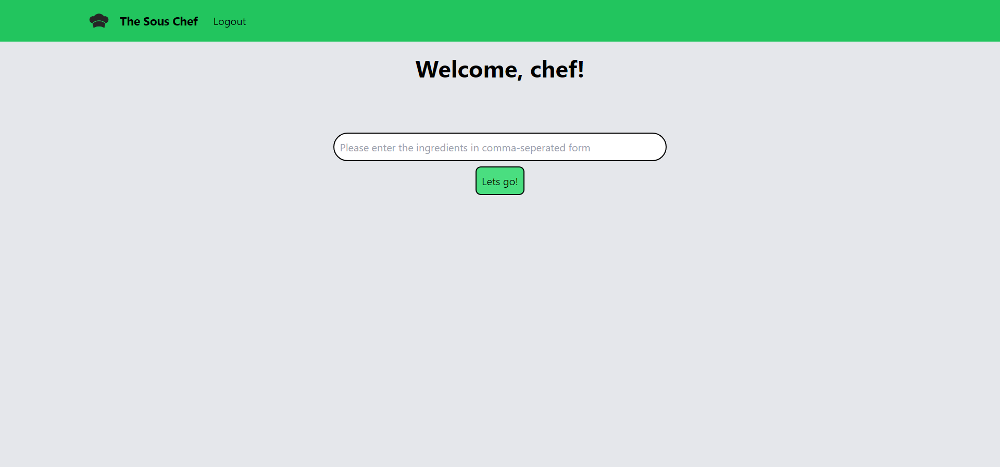
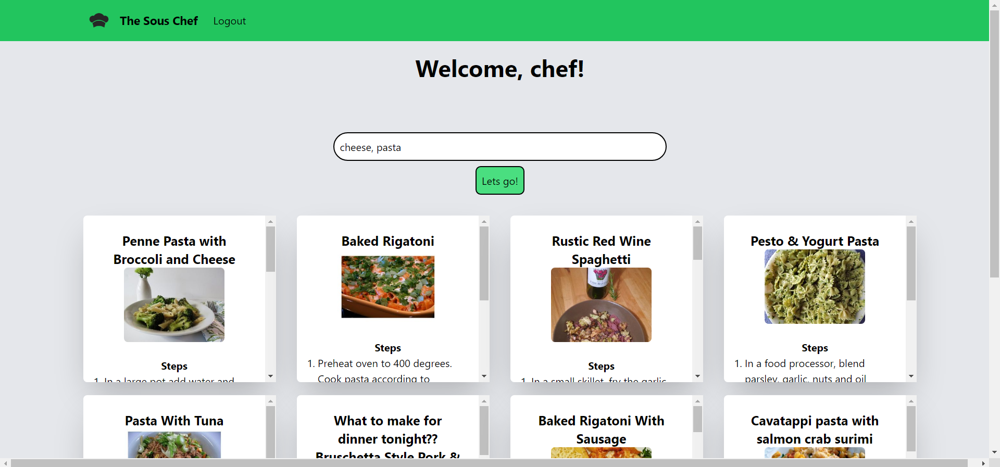

# The Sous Chef

A recipe recommendation site to make the lives of students easier! The recipes depend on the ingredient the user has at hand.

Checkout the site: [the-sous-chef.ml](https://www.the-sous-chef.ml/)

## Home Page:




## A Simple Login/ Signup Page:


``` Login not required to use the recipe search! ```

The site uses cloud services like Firebase, reCaptcha and Spoonacular API. The site itself was built using NextJS and TailwindCSS!

New improvements might be added in the future :D